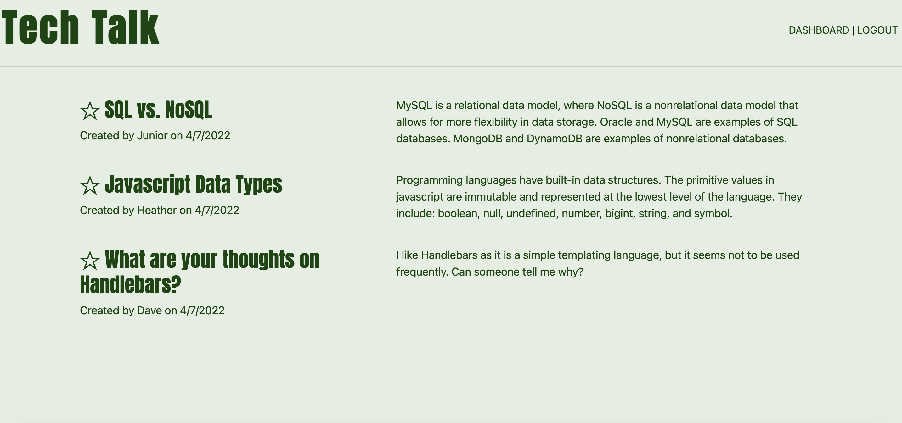

# 14 Model-View-Controller (MVC): Tech Blog

## Description

This blog application allows users a clean, organized way to discuss tech topics online.

The user arrives on the homepage with any existing blogs displayed on the page. There is a navigation bar where they can log in and either access an existing account or create a profile. Once logged in, a user can see all their existing blog posts on their profile page. From their profile page they can edit, delete, and create new blog posts.

While the user is logged in, they can navigate back to the homepage and view other user's blog posts and comment on those blog posts.

The user is able to easily log out at any time by clicking the "logout" button in the upper right corner of the screen. 

## Installation

This application requires Express.js, Sequelize, express-handlebars, express session, dotenv file, and MySQL2 database.

This application was deployed to Heroku.

## Screenshot

## License

This application is covered under an MIT License.

## Contact Me

GitHub: https://github.com/heatherveva

Email: heatherveva@gmail.com

## Links

GitHub Repository: https://github.com/heatherveva/hw14_techblog.git

GitHub Page: https://heatherveva.github.io/hw14_techblog/

Heroku:
